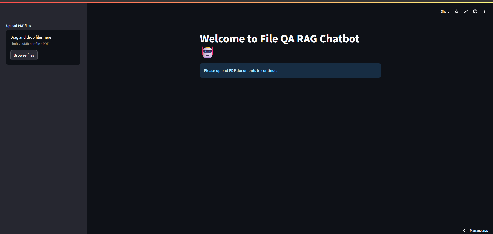
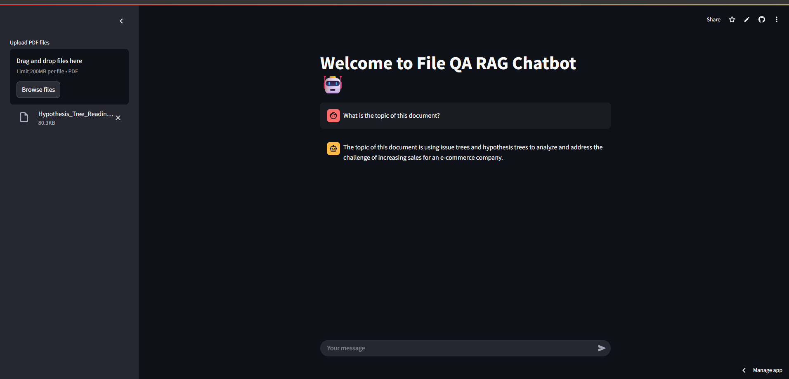

# 🤖 File QA RAG Chatbot App
A Retrieval-Augmented Generation (RAG) chatbot using OpenAI GPT-3.5 and Streamlit.

[](https://file-app-rag-chatbot.streamlit.app)

A Streamlit-based Retrieval-Augmented Generation (RAG) chatbot that allows users to upload PDF files and ask context-aware questions using OpenAI GPT-3.5 and LangChain.

## 🔗 Live App
👉 [Launch App](https://file-app-rag-chatbot.streamlit.app)

## 🧠 Features
- Upload multiple PDF files
- Extracts content and embeds using OpenAI Embeddings
- Retrieves relevant context using FAISS
- Streams GPT-3.5 answers based on your questions

## 🚀 Tech Stack
- Streamlit UI
- LangChain (Embeddings, Retriever, Prompting)
- OpenAI GPT-3.5 Turbo API
- FAISS (vector similarity search)

## 📸 Screenshots

### 🔹 Upload and Chat Interface


### 🔹 Sample Answer from GPT


## 📦 How to Run Locally
```bash
pip install -r requirements.txt
streamlit run app.py
```

## 🔐 API Key

This app uses OpenAI’s GPT-3.5 model via API.  
To run the app yourself, store your API key in **Streamlit Secrets**:

```
OPENAI_API_KEY = "your-openai-api-key"
```

> 🔒 The key is accessed securely via `st.secrets["OPENAI_API_KEY"]`.  
> No key input is required in the app UI.

## 📄 License
MIT License © 2025 Sanjana Shah

## 👤 Author

**Sanjana Shah**  
✨ Machine Learning & Generative AI Enthusiast  
📫 [LinkedIn](https://www.linkedin.com/in/sanjanavshah)

---

⭐ If you like this project, consider starring it on GitHub!
